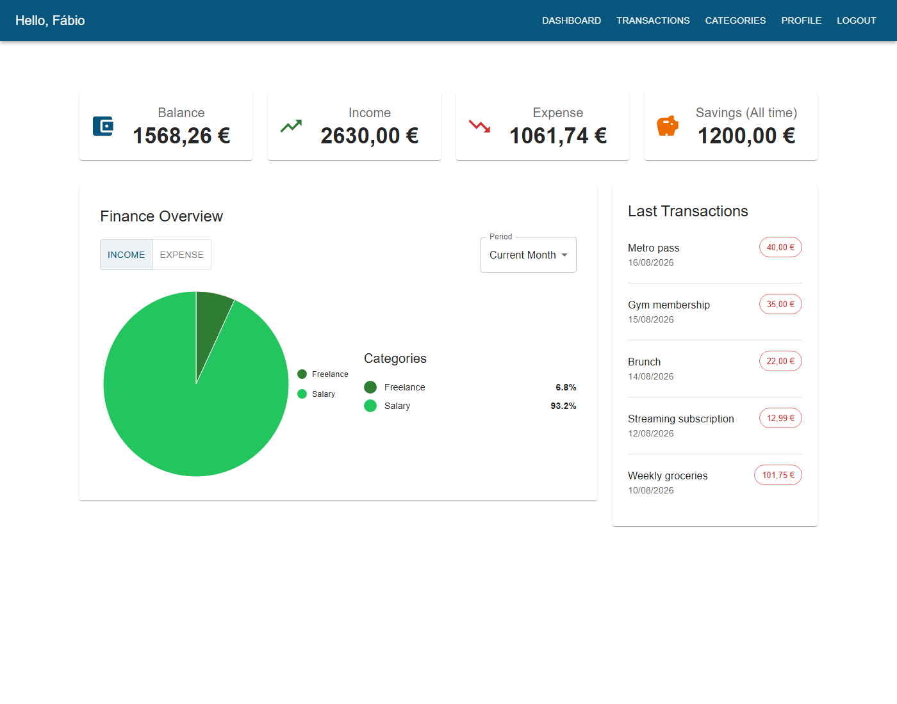

# Personal Finance Tracker

Tracks income and expenses: where the money came from, where it went, and what that looks like over time. Personal project, built solo.



## What it does

- Record income, expense, and savings transactions, organized by category — a set of default categories plus your own custom ones (name, color, icon)
- Dashboard with your current balance, income/expense totals for a selected period (current month, past month, current year, past year), an all-time savings total, a category breakdown pie chart, and your most recent transactions
- Filter the transaction list by type, category, and date range
- REST API secured with JWT authentication (register/login/refresh) — multi-user, each account only ever sees its own data — documented with OpenAPI/Swagger

## Stack

Spring Boot · React · PostgreSQL · Docker

## Running it

```bash
cp .env.example .env   # fill in POSTGRES_*, SPRING_DATASOURCE_*, SECURITY_JWT_SECRET_KEY
docker compose up --build
```

- App: http://localhost:3000
- API docs (Swagger UI): http://localhost:8080/swagger-ui/index.html

For local development instead (hot reload), run just the database and API in Docker and the frontend with npm:

```bash
docker compose up -d db backend   # PostgreSQL + API on :8080
cd frontend && npm install && npm start   # React app on :3000, proxies /api to :8080
```

## Status

Functional. Auth, categorized transactions (create/edit/delete), category management, and the dashboard all work end-to-end, backed by a JUnit test suite on the backend (~35 tests across services, security, and config). Not there yet: budgets, recurring transactions, and automated tests on the frontend. The "dark mode" and "email notifications" toggles on the profile page are placeholders — not implemented.
